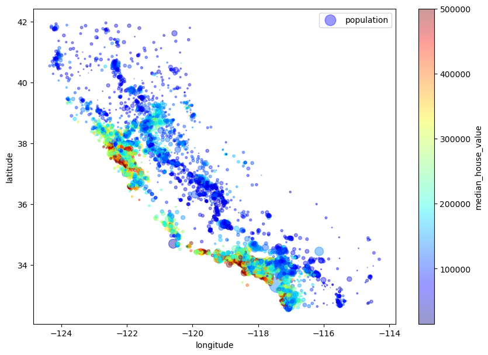
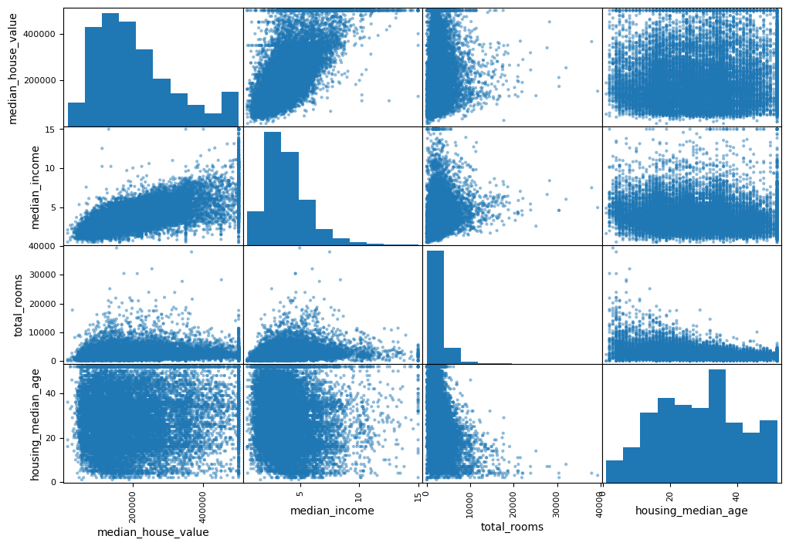

```python
import os
import tarfile
from six.moves import urllib

DOWNLOAD_ROOT = "https://raw.githubusercontent.com/ageron/handson-ml2/master/"
HOUSING_PATH = os.path.join("datasets", "housing")
HOUSING_URL = DOWNLOAD_ROOT + "datasets/housing/housing.tgz"

    
def fetch_housing_data(housing_url=HOUSING_URL, housing_path=HOUSING_PATH): 
    if not os.path.isdir(housing_path):
        os.makedirs(housing_path)
        tgz_path = os.path.join(housing_path, "housing.tgz")
        urllib.request.urlretrieve(housing_url, tgz_path)
        housing_tgz = tarfile.open(tgz_path)
        housing_tgz.extractall(path=housing_path)
        housing_tgz.close()

```


```python
import pandas as pd

def load_housing_data(housing_path=HOUSING_PATH): 
    csv_path = os.path.join(housing_path, "housing.csv") 
    return pd.read_csv(csv_path)
```


```python
fetch_housing_data()
```


```python
housing = load_housing_data()
housing.head()
```


<div>
<style scoped>
    .dataframe tbody tr th:only-of-type {
        vertical-align: middle;
    }

    .dataframe tbody tr th {
        vertical-align: top;
    }

    .dataframe thead th {
        text-align: right;
    }
</style>
<table border="1" class="dataframe">
  <thead>
    <tr style="text-align: right;">
      <th></th>
      <th>longitude</th>
      <th>latitude</th>
      <th>housing_median_age</th>
      <th>total_rooms</th>
      <th>total_bedrooms</th>
      <th>population</th>
      <th>households</th>
      <th>median_income</th>
      <th>median_house_value</th>
      <th>ocean_proximity</th>
    </tr>
  </thead>
  <tbody>
    <tr>
      <th>0</th>
      <td>-122.23</td>
      <td>37.88</td>
      <td>41.0</td>
      <td>880.0</td>
      <td>129.0</td>
      <td>322.0</td>
      <td>126.0</td>
      <td>8.3252</td>
      <td>452600.0</td>
      <td>NEAR BAY</td>
    </tr>
    <tr>
      <th>1</th>
      <td>-122.22</td>
      <td>37.86</td>
      <td>21.0</td>
      <td>7099.0</td>
      <td>1106.0</td>
      <td>2401.0</td>
      <td>1138.0</td>
      <td>8.3014</td>
      <td>358500.0</td>
      <td>NEAR BAY</td>
    </tr>
    <tr>
      <th>2</th>
      <td>-122.24</td>
      <td>37.85</td>
      <td>52.0</td>
      <td>1467.0</td>
      <td>190.0</td>
      <td>496.0</td>
      <td>177.0</td>
      <td>7.2574</td>
      <td>352100.0</td>
      <td>NEAR BAY</td>
    </tr>
    <tr>
      <th>3</th>
      <td>-122.25</td>
      <td>37.85</td>
      <td>52.0</td>
      <td>1274.0</td>
      <td>235.0</td>
      <td>558.0</td>
      <td>219.0</td>
      <td>5.6431</td>
      <td>341300.0</td>
      <td>NEAR BAY</td>
    </tr>
    <tr>
      <th>4</th>
      <td>-122.25</td>
      <td>37.85</td>
      <td>52.0</td>
      <td>1627.0</td>
      <td>280.0</td>
      <td>565.0</td>
      <td>259.0</td>
      <td>3.8462</td>
      <td>342200.0</td>
      <td>NEAR BAY</td>
    </tr>
  </tbody>
</table>
</div>


```python
housing.info()
```

    <class 'pandas.core.frame.DataFrame'>
    RangeIndex: 20640 entries, 0 to 20639
    Data columns (total 10 columns):
     #   Column              Non-Null Count  Dtype  
    ---  ------              --------------  -----  
     0   longitude           20640 non-null  float64
     1   latitude            20640 non-null  float64
     2   housing_median_age  20640 non-null  float64
     3   total_rooms         20640 non-null  float64
     4   total_bedrooms      20433 non-null  float64
     5   population          20640 non-null  float64
     6   households          20640 non-null  float64
     7   median_income       20640 non-null  float64
     8   median_house_value  20640 non-null  float64
     9   ocean_proximity     20640 non-null  object 
    dtypes: float64(9), object(1)
    memory usage: 1.6+ MB


```python
housing["ocean_proximity"].value_counts()
```


    <1H OCEAN     9136
    INLAND        6551
    NEAR OCEAN    2658
    NEAR BAY      2290
    ISLAND           5
    Name: ocean_proximity, dtype: int64


```python
housing.describe()
```


<div>
<style scoped>
    .dataframe tbody tr th:only-of-type {
        vertical-align: middle;
    }

    .dataframe tbody tr th {
        vertical-align: top;
    }

    .dataframe thead th {
        text-align: right;
    }
</style>
<table border="1" class="dataframe">
  <thead>
    <tr style="text-align: right;">
      <th></th>
      <th>longitude</th>
      <th>latitude</th>
      <th>housing_median_age</th>
      <th>total_rooms</th>
      <th>total_bedrooms</th>
      <th>population</th>
      <th>households</th>
      <th>median_income</th>
      <th>median_house_value</th>
    </tr>
  </thead>
  <tbody>
    <tr>
      <th>count</th>
      <td>20640.000000</td>
      <td>20640.000000</td>
      <td>20640.000000</td>
      <td>20640.000000</td>
      <td>20433.000000</td>
      <td>20640.000000</td>
      <td>20640.000000</td>
      <td>20640.000000</td>
      <td>20640.000000</td>
    </tr>
    <tr>
      <th>mean</th>
      <td>-119.569704</td>
      <td>35.631861</td>
      <td>28.639486</td>
      <td>2635.763081</td>
      <td>537.870553</td>
      <td>1425.476744</td>
      <td>499.539680</td>
      <td>3.870671</td>
      <td>206855.816909</td>
    </tr>
    <tr>
      <th>std</th>
      <td>2.003532</td>
      <td>2.135952</td>
      <td>12.585558</td>
      <td>2181.615252</td>
      <td>421.385070</td>
      <td>1132.462122</td>
      <td>382.329753</td>
      <td>1.899822</td>
      <td>115395.615874</td>
    </tr>
    <tr>
      <th>min</th>
      <td>-124.350000</td>
      <td>32.540000</td>
      <td>1.000000</td>
      <td>2.000000</td>
      <td>1.000000</td>
      <td>3.000000</td>
      <td>1.000000</td>
      <td>0.499900</td>
      <td>14999.000000</td>
    </tr>
    <tr>
      <th>25%</th>
      <td>-121.800000</td>
      <td>33.930000</td>
      <td>18.000000</td>
      <td>1447.750000</td>
      <td>296.000000</td>
      <td>787.000000</td>
      <td>280.000000</td>
      <td>2.563400</td>
      <td>119600.000000</td>
    </tr>
    <tr>
      <th>50%</th>
      <td>-118.490000</td>
      <td>34.260000</td>
      <td>29.000000</td>
      <td>2127.000000</td>
      <td>435.000000</td>
      <td>1166.000000</td>
      <td>409.000000</td>
      <td>3.534800</td>
      <td>179700.000000</td>
    </tr>
    <tr>
      <th>75%</th>
      <td>-118.010000</td>
      <td>37.710000</td>
      <td>37.000000</td>
      <td>3148.000000</td>
      <td>647.000000</td>
      <td>1725.000000</td>
      <td>605.000000</td>
      <td>4.743250</td>
      <td>264725.000000</td>
    </tr>
    <tr>
      <th>max</th>
      <td>-114.310000</td>
      <td>41.950000</td>
      <td>52.000000</td>
      <td>39320.000000</td>
      <td>6445.000000</td>
      <td>35682.000000</td>
      <td>6082.000000</td>
      <td>15.000100</td>
      <td>500001.000000</td>
    </tr>
  </tbody>
</table>
</div>


```python
%matplotlib inline
import matplotlib.pyplot as plt 
housing.hist(bins=50, figsize=(20, 15))
plt.show()
```


    

    


```python
import numpy as np

def split_train_test(data, test_ratio):
    shuffled_indices = np.random.permutation(len(data))
    test_set_size = int(len(data) * test_ratio)
    test_indices = shuffled_indices[:test_set_size]
    train_indices = shuffled_indices[test_set_size:]
    return data.iloc[train_indices], data.iloc[test_indices]

```


```python
train_set, test_set = split_train_test(housing, 0.2)
```


```python
len(train_set)
```


    16512


```python
len(test_set)
```


    4128


```python
from sklearn.model_selection import train_test_split

train_set, test_set = train_test_split(housing, test_size=0.2, random_state=42)

```


```python
housing['income_cat'] = pd.cut(housing['median_income'],
                               bins = [0., 1.5, 3.0, 4.5, 6., np.inf],
                               labels=[1, 2, 3, 4, 5])
```


```python
housing['income_cat'].hist()
```


    <AxesSubplot:>


    

    


```python
from sklearn.model_selection import StratifiedShuffleSplit

split = StratifiedShuffleSplit(n_splits=1, test_size=0.2, random_state=42)
for train_index, test_index in split.split(housing, housing['income_cat']):
    strat_train_set = housing.loc[train_index]
    strat_test_set = housing.loc[test_index]
    
```


```python
strat_test_set['income_cat'].value_counts() / len(strat_test_set)
```


    3    0.350533
    2    0.318798
    4    0.176357
    5    0.114341
    1    0.039971
    Name: income_cat, dtype: float64


```python
for set_ in (strat_train_set, strat_test_set):
    set_.drop('income_cat', axis=1, inplace=True)
    
```


```python
housing = strat_train_set.copy()
```


```python
housing.plot(kind='scatter', x='longitude', y='latitude')
```


    <AxesSubplot:xlabel='longitude', ylabel='latitude'>


    

    


```python
housing.plot(kind='scatter', x='longitude', y='latitude', alpha=0.1)
```


    <AxesSubplot:xlabel='longitude', ylabel='latitude'>


    

    


```python
housing.plot(kind='scatter', x='longitude', y='latitude', alpha=0.4,
             s=housing['population']/100, label='population', figsize=(10,7),
             c='median_house_value', cmap=plt.get_cmap('jet'), colorbar=True,
            )
plt.legend()
```


    <matplotlib.legend.Legend at 0x7fd42bbfa310>


    

    


```python
corr_matrix = housing.corr()
corr_matrix['median_house_value'].sort_values(ascending=False)
```


    median_house_value    1.000000
    median_income         0.687151
    total_rooms           0.135140
    housing_median_age    0.114146
    households            0.064590
    total_bedrooms        0.047781
    population           -0.026882
    longitude            -0.047466
    latitude             -0.142673
    Name: median_house_value, dtype: float64


```python
from pandas.plotting import scatter_matrix

attributes = ['median_house_value', 'median_income', 'total_rooms',
             'housing_median_age']
scatter_matrix(housing[attributes], figsize=(12, 8))
```


    array([[<AxesSubplot:xlabel='median_house_value', ylabel='median_house_value'>,
            <AxesSubplot:xlabel='median_income', ylabel='median_house_value'>,
            <AxesSubplot:xlabel='total_rooms', ylabel='median_house_value'>,
            <AxesSubplot:xlabel='housing_median_age', ylabel='median_house_value'>],
           [<AxesSubplot:xlabel='median_house_value', ylabel='median_income'>,
            <AxesSubplot:xlabel='median_income', ylabel='median_income'>,
            <AxesSubplot:xlabel='total_rooms', ylabel='median_income'>,
            <AxesSubplot:xlabel='housing_median_age', ylabel='median_income'>],
           [<AxesSubplot:xlabel='median_house_value', ylabel='total_rooms'>,
            <AxesSubplot:xlabel='median_income', ylabel='total_rooms'>,
            <AxesSubplot:xlabel='total_rooms', ylabel='total_rooms'>,
            <AxesSubplot:xlabel='housing_median_age', ylabel='total_rooms'>],
           [<AxesSubplot:xlabel='median_house_value', ylabel='housing_median_age'>,
            <AxesSubplot:xlabel='median_income', ylabel='housing_median_age'>,
            <AxesSubplot:xlabel='total_rooms', ylabel='housing_median_age'>,
            <AxesSubplot:xlabel='housing_median_age', ylabel='housing_median_age'>]],
          dtype=object)


    

    


```python
housing.plot(kind='scatter', x='median_income', y='median_house_value',
             alpha=0.1)
```


    <AxesSubplot:xlabel='median_income', ylabel='median_house_value'>


    

    


```python
housing = strat_train_set.drop('median_house_value', axis=1)
housing_labels = strat_train_set['median_house_value'].copy()
```


```python
housing.dropna(subset=['total_bedrooms'])
```


<div>
<style scoped>
    .dataframe tbody tr th:only-of-type {
        vertical-align: middle;
    }

    .dataframe tbody tr th {
        vertical-align: top;
    }

    .dataframe thead th {
        text-align: right;
    }
</style>
<table border="1" class="dataframe">
  <thead>
    <tr style="text-align: right;">
      <th></th>
      <th>longitude</th>
      <th>latitude</th>
      <th>housing_median_age</th>
      <th>total_rooms</th>
      <th>total_bedrooms</th>
      <th>population</th>
      <th>households</th>
      <th>median_income</th>
      <th>ocean_proximity</th>
    </tr>
  </thead>
  <tbody>
    <tr>
      <th>12655</th>
      <td>-121.46</td>
      <td>38.52</td>
      <td>29.0</td>
      <td>3873.0</td>
      <td>797.0</td>
      <td>2237.0</td>
      <td>706.0</td>
      <td>2.1736</td>
      <td>INLAND</td>
    </tr>
    <tr>
      <th>15502</th>
      <td>-117.23</td>
      <td>33.09</td>
      <td>7.0</td>
      <td>5320.0</td>
      <td>855.0</td>
      <td>2015.0</td>
      <td>768.0</td>
      <td>6.3373</td>
      <td>NEAR OCEAN</td>
    </tr>
    <tr>
      <th>2908</th>
      <td>-119.04</td>
      <td>35.37</td>
      <td>44.0</td>
      <td>1618.0</td>
      <td>310.0</td>
      <td>667.0</td>
      <td>300.0</td>
      <td>2.8750</td>
      <td>INLAND</td>
    </tr>
    <tr>
      <th>14053</th>
      <td>-117.13</td>
      <td>32.75</td>
      <td>24.0</td>
      <td>1877.0</td>
      <td>519.0</td>
      <td>898.0</td>
      <td>483.0</td>
      <td>2.2264</td>
      <td>NEAR OCEAN</td>
    </tr>
    <tr>
      <th>20496</th>
      <td>-118.70</td>
      <td>34.28</td>
      <td>27.0</td>
      <td>3536.0</td>
      <td>646.0</td>
      <td>1837.0</td>
      <td>580.0</td>
      <td>4.4964</td>
      <td>&lt;1H OCEAN</td>
    </tr>
    <tr>
      <th>...</th>
      <td>...</td>
      <td>...</td>
      <td>...</td>
      <td>...</td>
      <td>...</td>
      <td>...</td>
      <td>...</td>
      <td>...</td>
      <td>...</td>
    </tr>
    <tr>
      <th>15174</th>
      <td>-117.07</td>
      <td>33.03</td>
      <td>14.0</td>
      <td>6665.0</td>
      <td>1231.0</td>
      <td>2026.0</td>
      <td>1001.0</td>
      <td>5.0900</td>
      <td>&lt;1H OCEAN</td>
    </tr>
    <tr>
      <th>12661</th>
      <td>-121.42</td>
      <td>38.51</td>
      <td>15.0</td>
      <td>7901.0</td>
      <td>1422.0</td>
      <td>4769.0</td>
      <td>1418.0</td>
      <td>2.8139</td>
      <td>INLAND</td>
    </tr>
    <tr>
      <th>19263</th>
      <td>-122.72</td>
      <td>38.44</td>
      <td>48.0</td>
      <td>707.0</td>
      <td>166.0</td>
      <td>458.0</td>
      <td>172.0</td>
      <td>3.1797</td>
      <td>&lt;1H OCEAN</td>
    </tr>
    <tr>
      <th>19140</th>
      <td>-122.70</td>
      <td>38.31</td>
      <td>14.0</td>
      <td>3155.0</td>
      <td>580.0</td>
      <td>1208.0</td>
      <td>501.0</td>
      <td>4.1964</td>
      <td>&lt;1H OCEAN</td>
    </tr>
    <tr>
      <th>19773</th>
      <td>-122.14</td>
      <td>39.97</td>
      <td>27.0</td>
      <td>1079.0</td>
      <td>222.0</td>
      <td>625.0</td>
      <td>197.0</td>
      <td>3.1319</td>
      <td>INLAND</td>
    </tr>
  </tbody>
</table>
<p>16354 rows × 9 columns</p>
</div>


```python
from sklearn.impute import SimpleImputer
```


```python
imputer = SimpleImputer(strategy='median')
```


```python
housing_num = housing.drop('ocean_proximity', axis=1)
```


```python
imputer.fit(housing_num)
```


    SimpleImputer(strategy='median')


```python
imputer.statistics_
```


    array([-118.51   ,   34.26   ,   29.     , 2119.     ,  433.     ,
           1164.     ,  408.     ,    3.54155])


```python
housing_num.median().values
```


    array([-118.51   ,   34.26   ,   29.     , 2119.     ,  433.     ,
           1164.     ,  408.     ,    3.54155])


```python
X = imputer.transform(housing_num)
```


```python
from sklearn.preprocessing import OrdinalEncoder
ordinal_encoder = OrdinalEncoder()
```


```python
housing_cat = housing[["ocean_proximity"]]
housing_cat.head(10)
housing_cat_encoded = ordinal_encoder.fit_transform(housing_cat)
housing_cat_encoded[:10]
```


    array([[1.],
           [4.],
           [1.],
           [4.],
           [0.],
           [3.],
           [0.],
           [0.],
           [0.],
           [0.]])


```python
ordinal_encoder.categories_
```


    [array(['<1H OCEAN', 'INLAND', 'ISLAND', 'NEAR BAY', 'NEAR OCEAN'],
           dtype=object)]


```python
from sklearn.preprocessing import OneHotEncoder
cat_encoder = OneHotEncoder()
housing_cat_1hot = cat_encoder.fit_transform(housing_cat)
housing_cat_1hot
```


    <16512x5 sparse matrix of type '<class 'numpy.float64'>'
    	with 16512 stored elements in Compressed Sparse Row format>


```python
housing_cat_1hot.toarray()
```


    array([[0., 1., 0., 0., 0.],
           [0., 0., 0., 0., 1.],
           [0., 1., 0., 0., 0.],
           ...,
           [1., 0., 0., 0., 0.],
           [1., 0., 0., 0., 0.],
           [0., 1., 0., 0., 0.]])


```python
from sklearn.base import BaseEstimator, TransformerMixin
rooms_ix, bedrooms_ix, population_ix, households_ix = 3, 4, 5, 6
class CombinedAttributesAdder(BaseEstimator, TransformerMixin):
    def __init__(self, add_bedrooms_per_room = True): # no *args or **kargs
        self.add_bedrooms_per_room = add_bedrooms_per_room 
    def fit(self, X, y=None):
        return self # nothing else to do 
    def transform(self, X, y=None):
        rooms_per_household = X[:, rooms_ix] / X[:, households_ix] 
        population_per_household = X[:, population_ix] / X[:, households_ix] 
        if self.add_bedrooms_per_room:
            bedrooms_per_room = X[:, bedrooms_ix] / X[:, rooms_ix]
            return np.c_[X, rooms_per_household, population_per_household,
                         bedrooms_per_room]
        else:
            return np.c_[X, rooms_per_household, population_per_household]
attr_adder = CombinedAttributesAdder(add_bedrooms_per_room=False)
housing_extra_attribs = attr_adder.transform(housing.values)
```


```python
from sklearn.pipeline import Pipeline
from sklearn.preprocessing import StandardScaler
num_pipeline = Pipeline([
            ('imputer', SimpleImputer(strategy="median")),
            ('attribs_adder', CombinedAttributesAdder()),
            ('std_scaler', StandardScaler()),
        ])
housing_num_tr = num_pipeline.fit_transform(housing_num)
```


```python
from sklearn.compose import ColumnTransformer 
num_attribs = list(housing_num)
cat_attribs = ["ocean_proximity"]
full_pipeline = ColumnTransformer([
             ("num", num_pipeline, num_attribs),
             ("cat", OneHotEncoder(), cat_attribs),
         ])
housing_prepared = full_pipeline.fit_transform(housing)
```


```python
# Training the Model 
```


```python
from sklearn.linear_model import LinearRegression
```


```python
lin_reg = LinearRegression()
```


```python
lin_reg.fit(housing_prepared, housing_labels)

```


    LinearRegression()


```python
some_data = housing.iloc[:5]
some_labels = housing_labels.iloc[:5]
some_data_prepared = full_pipeline.transform(some_data)
```


```python
print("Predictions:", lin_reg.predict(some_data_prepared))

```

    Predictions: [ 85657.90192014 305492.60737488 152056.46122456 186095.70946094
     244550.67966089]


```python
print("Labels", list(some_labels))
```

    Labels [72100.0, 279600.0, 82700.0, 112500.0, 238300.0]


```python
from sklearn.tree import DecisionTreeRegressor

tree_reg = DecisionTreeRegressor()
tree_reg.fit(housing_prepared, housing_labels)
```


    DecisionTreeRegressor()


```python
from sklearn.metrics import mean_squared_error
housing_predictions = lin_reg.predict(housing_prepared)
lin_mse = mean_squared_error(housing_labels, housing_predictions)
lin_rmse = np.sqrt(lin_mse)

lin_rmse
housing_predictions = tree_reg.predict(housing_prepared)
tree_mse = mean_squared_error(housing_labels, housing_predictions)
tree_rmse = np.sqrt(tree_mse)
tree_rmse
```


    0.0


